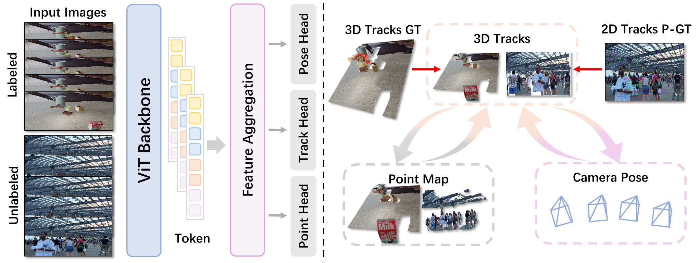

# [SIGGRAPH 2026] TrajVG: 3D Trajectory-Coupled Visual Geometry Learning

[](https://xingy038.github.io/TrajVG/)
[](https://arxiv.org/abs/2602.04439)

The official implementation for TrajVG.



We propose TrajVG, a reconstruction framework that makes cross-frame 3D correspondence an explicit prediction by estimating camera-coordinate 3D trajectories. We couple sparse trajectories, per-frame local point maps, and relative camera poses with geometric consistency objectives: (i) bidirectional trajectory–pointmap consistency with controlled gradient flow, and (ii) a pose consistency objective driven by static track anchors that suppresses gradients from dynamic regions. To scale training to in-the-wild videos where 3D trajectory labels are scarce, we reformulate the same coupling constraints into self-supervised objectives using only pseudo 2D tracks, enabling unified training with mixed supervision. Extensive experiments across 3D tracking, pose estimation, point-map reconstruction, and video depth show that TrajVG surpasses the current feedforward performance baseline.

## 🛠️ Installation

```bash
git clone https://github.com/xingy038/TrajVG.git
cd TrajVG
pip install -r requirements.txt
```

Build the optional `pointops2` extension only in a CUDA environment:

```bash
cd third_party/pointops2
pip install -e .
cd ../..
```

## 🕹️  Inference
The checkpoint can be downloaded from [this link](https://drive.google.com/file/d/1vk27rkLPJrYVUgD7tCFw2ti5NQLYk2PK/view?usp=sharing).

Run on an image directory or a video:

```bash
python infer.py \
  --input /path/to/images_or_video.mp4 \
  --checkpoint /path/to/trajvg_checkpoint.bin \
  --output-ply outputs/result.ply \
  --output-npz outputs/result.npz
```

## ✨ Visualize NPZ

`infer.py` writes an NPZ with:

- `world_points`: `(T, N, 3)` point cloud per frame.
- `extrinsics`: `(T, 4, 4)` camera transforms.
- `colors`: `(T, N, 3)` uint8 RGB values.
- `trajectories`: `(T, M, 3)` predicted 3D trajectories.
- `visibility`: `(T, M)` trajectory visibility mask.

Start the browser viewer:

```bash
python visualization/visualize.py outputs/result.npz --port 8000
```

Open the printed local URL in a browser.

## 🎓 BibTeX

If you find TrajVG useful, please cite:

```bibtex
@article{TrajVG,
      title={TrajVG: 3D Trajectory-Coupled Visual Geometry Learning}, 
      author={Xingyu Miao and Weiguang Zhao and Tao Lu and Linning Xu and Mulin Yu and Yang Long and Jiangmiao Pang and Junting Dong},
      year={2026},
      eprint={2602.04439},
      archivePrefix={arXiv},
      primaryClass={cs.CV},
      url={https://arxiv.org/abs/2602.04439}, 
}
```
## 🙏 Acknowledgement

This project would not be possible without many excellent open-source codebases. Notable examples include [Pi3](https://github.com/yyfz/Pi3), [CoTracker3](https://github.com/facebookresearch/co-tracker), [VGGT](https://github.com/facebookresearch/vggt), and [TAPIP3D](https://github.com/zbw001/TAPIP3D), among others.

## Contact

**Email:** xingyu.miao@durham.ac.uk
